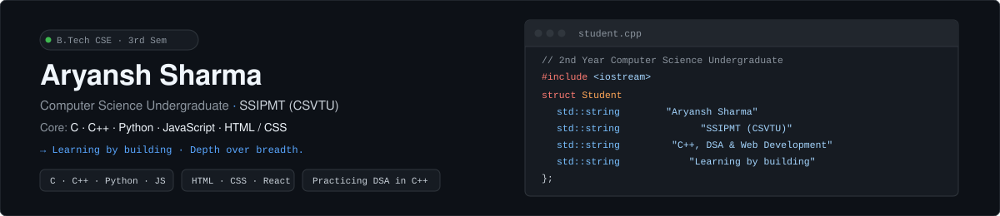
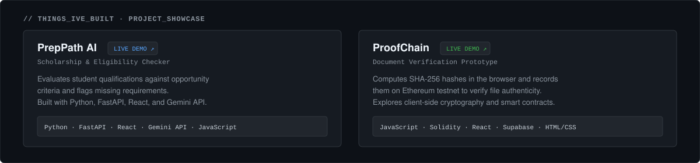

<div align="center">

  

  <br/><br/>

  [](https://github.com/aryanshsharma2025-max)
  [](https://www.linkedin.com/in/aryansh-sharma-b17a05396)
  [](mailto:aryansh.sharma2025@ssipmt.com)
  [](https://github.com/aryanshsharma2025-max)

</div>

---

### 👨‍💻 Executive Summary

> **Computer Science Engineering Undergraduate (B.Tech CSE)** focused on building resilient full-stack systems, production AI pipelines, and decentralized Web3 applications. Committed to strong algorithmic fundamentals, clean system design, and building software that bridges rigorous logic with intuitive interfaces.

- 🔭 **Current Focus**: Architecting AI-assisted decision systems & deep Data Structures & Algorithms in **C++** and **Python**.
- ⚡ **Engineering Principles**: Deterministic rule execution, type safety, modular micro-architectures, and zero-hallucination AI pipelines.
- 🎓 **Education**: Computer Science Engineering (3rd Semester) at Shri Shankaracharya Institute of Professional Management & Technology (SSIPMT).
- 💬 **Ask me about**: Full-Stack Development (React/FastAPI), Gemini AI API integration, Ethereum Smart Contracts (Solidity), or Core CS fundamentals.

---

### 🚀 Featured Deployments & Systems

<div align="center">
  
</div>

<br/>

| Project | Domain / Highlights | Architecture & Stack | Live Demo / Source |
|:---|:---|:---|:---:|
| **[PrepPath AI](https://github.com/aryanshsharma2025-max/PrepPath-AI)** | **Opportunity-to-Application Readiness Platform**<br/>• Dual-layer engine separating deterministic rule checking from LLM extraction.<br/>• Eliminates hallucinated scholarship eligibility and flags missing documentation. | `Python` `FastAPI` `React 18`<br/>`Gemini AI` `Tailwind CSS` `Vite` | [](https://preppath-ai.vercel.app) <br/> [](https://github.com/aryanshsharma2025-max/PrepPath-AI) |
| **[ProofChain](https://github.com/aryanshsharma2025-max/ProofChain)** | **Decentralized Document Integrity & Verification**<br/>• Anchors SHA-256 cryptographic document hashes onto Ethereum Sepolia.<br/>• Immutable verification preventing tampering with certificates & legal records. | `TypeScript` `Solidity` `Hardhat`<br/>`Ethereum` `React` `Supabase` | [](https://proof-chain-kappa.vercel.app) <br/> [](https://github.com/aryanshsharma2025-max/ProofChain) |
| **[Basic-AI-Chatbot](https://github.com/aryanshsharma2025-max/Basic-AI-Chatbot)** | **Conversational NLP & Keyword Intent CLI**<br/>• Dynamic CLI interface for contextual parsing and intent-matching engine. | `Python` `CLI` `Intent Engine` | [](https://github.com/aryanshsharma2025-max/Basic-AI-Chatbot) |
| **[Academic Grading Engine](https://github.com/aryanshsharma2025-max/student-grade-calculator-python)** | **Student Evaluation & Performance Suite**<br/>• OOP-driven grading, CGPA computation, statistical analysis, and record storage. | `Python` `OOP` `Clean Architecture` | [](https://github.com/aryanshsharma2025-max/student-grade-calculator-python) |

---

### 📚 Core Computer Science & Algorithmic Repositories

My daily practice and academic coursework repositories are structured into modular, topic-wise packages with complete problem breakdowns:

```
CODING-LANGUAGES/
├── 📁 cpp-practice/          ── 20 Modules (Basics, Control Flow, Functions, OOP, STL, DSA, Mini-Projects)
├── 📁 Python-Programs/       ── 15 Modules (Recursion, NumPy N-D Matrices, Pandas DataFrames, Matplotlib, Tkinter)
└── 📁 C-programs--college-/  ── 17 Modules (Pointers, Memory Management, DMA malloc/calloc, Structs, File Streams)
```

- **[cpp-practice](https://github.com/aryanshsharma2025-max/cpp-practice)** — 20 modular directories covering core C++ syntax, object-oriented design patterns (Inheritance, Polymorphism, Abstract classes), STL containers (`vector`, `map`, `set`, `algorithm`), and daily Data Structures & Algorithms practice.
- **[Python-Programs](https://github.com/aryanshsharma2025-max/Python-Programs)** — 15 structured modules spanning Python core concepts, recursion, custom exceptions, mathematical number theory, NumPy matrix algebra, Pandas data analysis, Matplotlib visualization, and interactive GUI apps.
- **[C-programs--college-](https://github.com/aryanshsharma2025-max/C-programs--college-)** — 17 structured topics exploring pointer arithmetic, dynamic memory allocation (`malloc`, `calloc`, `free`), multi-dimensional matrix operations, file handling (`fopen`, `fprintf`), and foundational search/sort algorithms.

---

### 🛠️ Technical Arsenal & Tooling Matrix

<table>
  <tr>
    <td align="center" width="20%"><strong>Languages</strong></td>
    <td>
      
      
      
      
      
      
      
      
    </td>
  </tr>
  <tr>
    <td align="center" width="20%"><strong>Frontend & Web</strong></td>
    <td>
      
      
      
    </td>
  </tr>
  <tr>
    <td align="center" width="20%"><strong>Backend & AI</strong></td>
    <td>
      
      
      
      
      
    </td>
  </tr>
  <tr>
    <td align="center" width="20%"><strong>Web3 & Cloud</strong></td>
    <td>
      
      
      
      
    </td>
  </tr>
  <tr>
    <td align="center" width="20%"><strong>DevOps & Tools</strong></td>
    <td>
      
      
      
      
    </td>
  </tr>
</table>

---

### 📊 GitHub Activity & Metrics

<div align="center">
  
  
</div>

<div align="center" style="margin-top: 15px;">
  
</div>

---

### 📫 Get In Touch

<div align="center">

  **Looking for ambitious engineering teams, open-source collaborations, and internship opportunities.**

  <br/>

  <a href="https://www.linkedin.com/in/aryansh-sharma-b17a05396">
    
  </a>
  &nbsp;&nbsp;
  <a href="mailto:aryansh.sharma2025@ssipmt.com">
    
  </a>
  &nbsp;&nbsp;
  <a href="https://github.com/aryanshsharma2025-max">
    
  </a>

  <br/><br/>
  <sub>© 2026 Aryansh Sharma • Built with care, precision, and continuous learning.</sub>
</div>
