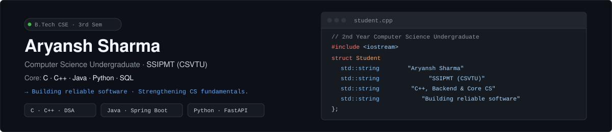
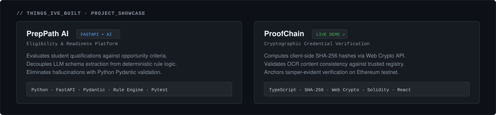

<div align="center">

  

  <br/><br/>

  [](https://github.com/aryanshsharma2025-max)
  [](https://www.linkedin.com/in/aryansh-sharma-b17a05396)
  [](mailto:aryansh.sharma2025@ssipmt.com)
  [](https://github.com/aryanshsharma2025-max)

</div>

---

### 👨‍💻 About Me

I'm a Computer Science & Engineering undergraduate (3rd Semester) at SSIPMT Raipur (CSVTU), focused on strengthening programming fundamentals, problem solving, and software engineering foundations.

I started with C and Python, and have been expanding into C++, JavaScript, and web development through coursework and practical projects. My current priority is developing stronger Data Structures & Algorithms and C++ problem-solving skills.

---

### 🛠️ Skills & Technical Exposure

<div align="center">

| Category | Technologies & Tools |
|---|---|
| **Core Programming** | `C` &nbsp;•&nbsp; `C++` &nbsp;•&nbsp; `Python` &nbsp;•&nbsp; `JavaScript` |
| **Project Exposure** | `React` &nbsp;•&nbsp; `FastAPI` &nbsp;•&nbsp; `Spring Boot` &nbsp;•&nbsp; `MySQL` &nbsp;•&nbsp; `Supabase` &nbsp;•&nbsp; `Gemini API` &nbsp;•&nbsp; `Solidity` &nbsp;•&nbsp; `Hardhat` &nbsp;•&nbsp; `Pytest` |
| **Currently Learning** | `C++ STL` &nbsp;•&nbsp; `Data Structures & Algorithms` &nbsp;•&nbsp; `SQL Schema Normalization` &nbsp;•&nbsp; `Backend Architecture` |
| **Web Fundamentals** | `HTML5` &nbsp;•&nbsp; `CSS3` &nbsp;•&nbsp; `DOM Manipulation` &nbsp;•&nbsp; `Responsive Web Design` |
| **Developer Tools** | `Git` &nbsp;•&nbsp; `GitHub` &nbsp;•&nbsp; `VS Code` |

</div>

---

### 🎯 What I'm Learning

> *"My current priority is depth over breadth — mastering core computer science fundamentals and problem solving before chasing every new framework."*

```
Programming Fundamentals
          ↓
       C / C++
          ↓
      OOP + STL
          ↓
Data Structures & Algorithms
          ↓
Web / Backend Development
          ↓
Applied Software Projects
```

- 🧩 **Data Structures & Algorithms**: Practicing arrays, strings, recursion, pointers, and foundational algorithms in **C++** on LeetCode.
- ⚡ **C++ & STL**: Advancing from procedural C to modern C++, strengthening OOP design and Standard Template Library containers.
- 🌐 **Web Development**: Strengthening core **HTML/CSS/JavaScript**, DOM manipulation, and component-based frontend engineering with React.
- 🗄️ **Database & Backend**: Learning relational schema design, table normalization, constraints, and RESTful API fundamentals.

---

### 🚀 Things I've Built

<div align="center">
  
</div>

<br/>

| Project | Description | Technologies Explored | Links |
|:---|:---|:---|:---:|
| **[PrepPath AI](https://github.com/aryanshsharma2025-max/PrepPath-AI)** | Opportunity-to-application readiness platform combining Gemini document schema extraction with deterministic Python rule evaluation to evaluate applicant eligibility without hallucinations. | `Python` `FastAPI` `React` `Gemini API` `Pydantic` | [](https://github.com/aryanshsharma2025-max/PrepPath-AI) |
| **[ProofChain](https://github.com/aryanshsharma2025-max/ProofChain)** | Decentralized credential integrity and verification system using client-side SHA-256 Web Crypto hashing, OCR consistency checking, and Ethereum Sepolia smart contract anchoring. | `JavaScript` `TypeScript` `Solidity` `React` `Supabase` | [](https://proof-chain-kappa.vercel.app) <br/> [](https://github.com/aryanshsharma2025-max/ProofChain) |
| **[Smart Attendance](https://github.com/aryanshsharma2025-max/Smart-Attendance)** | Attendance management system with layered Java Spring Boot backend, MySQL relational schema, and role-based JWT authentication. | `Java` `Spring Boot` `MySQL` `Spring Security` `JWT` | [](https://github.com/aryanshsharma2025-max/Smart-Attendance) |
| **[SAAP (Academic Analytics)](https://github.com/aryanshsharma2025-max/Success_Academic_Analytics_Platform)** | Semester 3 prototype for an institutional academic analytics platform featuring student cohort tracking, synthetic datasets, and simulated RBAC across 16 screens. *(Frontend prototype; backend planned for Sem 4)*. | `React` `Vite` `JavaScript` `CSS3` `Prototype` | [](https://github.com/aryanshsharma2025-max/Success_Academic_Analytics_Platform) |
| **[Portfolio Website](https://github.com/aryanshsharma2025-max/Portfolio)** | Personal developer portfolio website built with pure vanilla HTML, CSS, and JavaScript featuring responsive interactive components. | `HTML5` `CSS3` `JavaScript` `Responsive Design` | [](https://github.com/aryanshsharma2025-max/Portfolio) |

---

### 💻 Coding Practice & Coursework

Structured coursework and self-directed practice across core languages:

- **[C Programming](https://github.com/aryanshsharma2025-max/C-programs--college-)** — Semester 1 college coursework covering pointers, dynamic memory allocation (`malloc`, `calloc`, `free`), structures, multi-dimensional arrays, file streams, and searching/sorting algorithms.
- **[C++ Practice & STL](https://github.com/aryanshsharma2025-max/cpp-practice)** — 20 topic-wise modules covering C++ syntax, object-oriented programming (classes, inheritance, polymorphism), STL containers (`vector`, `map`, `set`, iterators), and algorithmic problem solving.
- **[LeetCode Solutions](https://github.com/aryanshsharma2025-max/leetcode-solutions)** — Ongoing repository of Data Structures & Algorithms problems solved in C++, focusing on algorithmic patterns, clean implementations, and time/space complexity analysis.
- **[Python Practice](https://github.com/aryanshsharma2025-max/Python-Programs)** — Semester 2 college coursework covering core syntax, recursion, exception handling, file I/O, and foundational data analysis with NumPy and Matplotlib.

---

### 📫 Get In Touch

<div align="center">

  **Open to student software engineering internships, learning opportunities, and technical collaborations.**

  <br/>

  <a href="https://www.linkedin.com/in/aryansh-sharma-b17a05396">
    
  </a>
  &nbsp;&nbsp;
  <a href="mailto:aryansh.sharma2025@ssipmt.com">
    
  </a>
  &nbsp;&nbsp;
  <a href="https://github.com/aryanshsharma2025-max">
    
  </a>

  <br/><br/>
  <sub>© 2026 Aryansh Sharma • Computer Science & Engineering Undergraduate</sub>
</div>